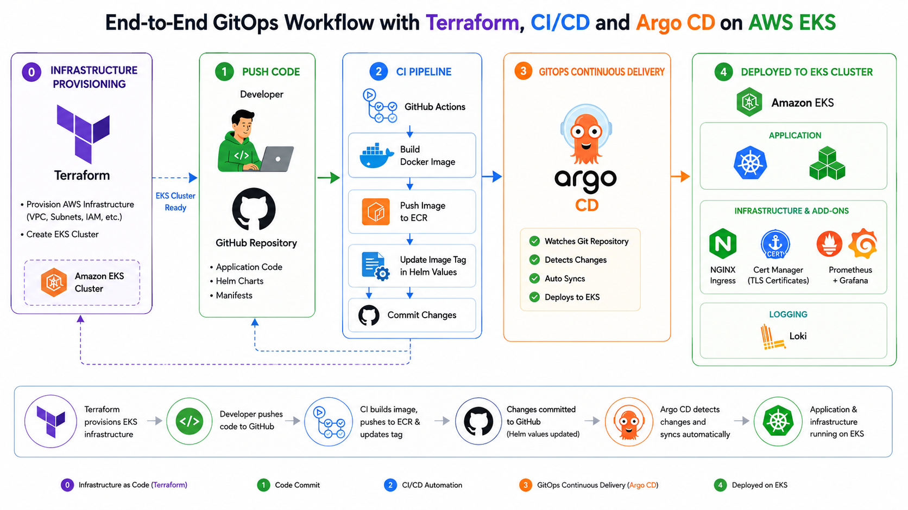
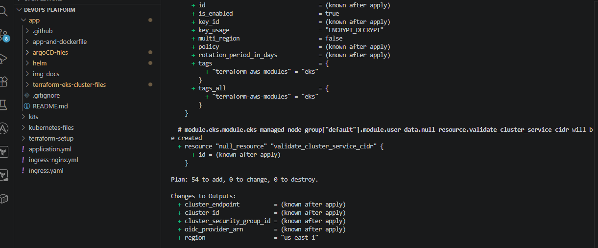
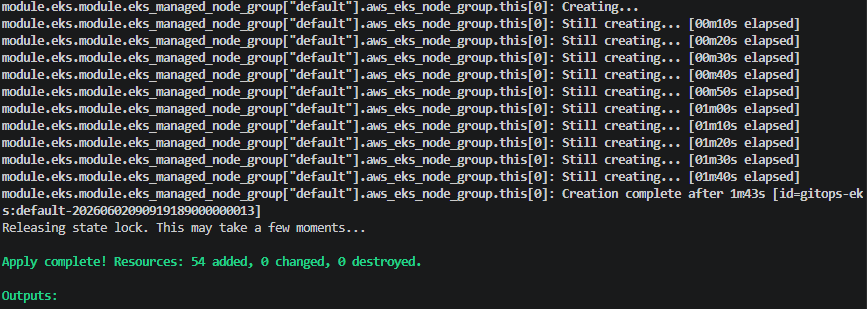
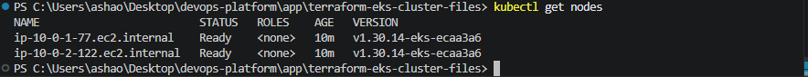
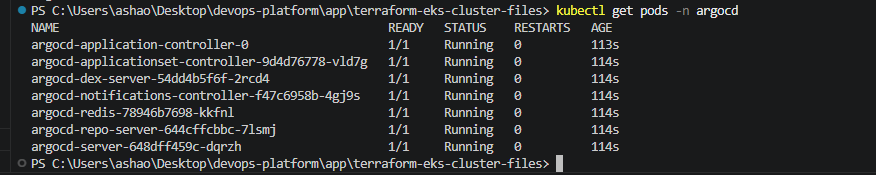
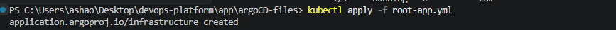
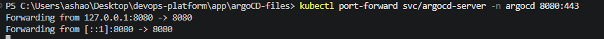
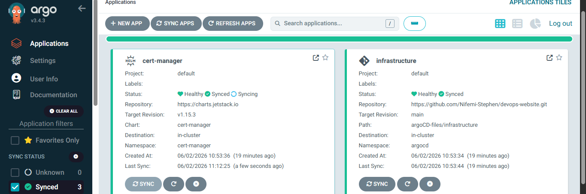
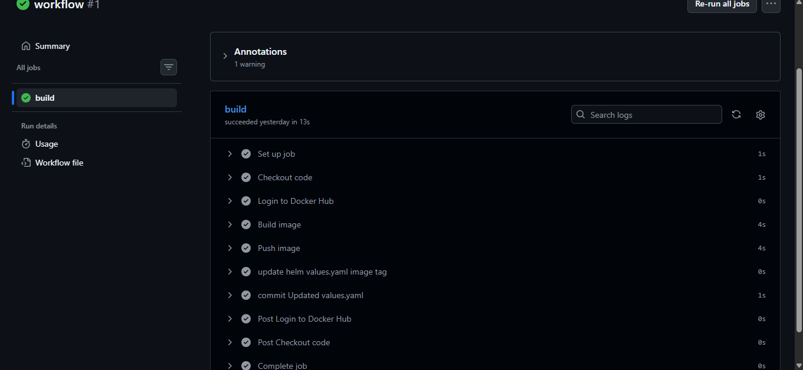
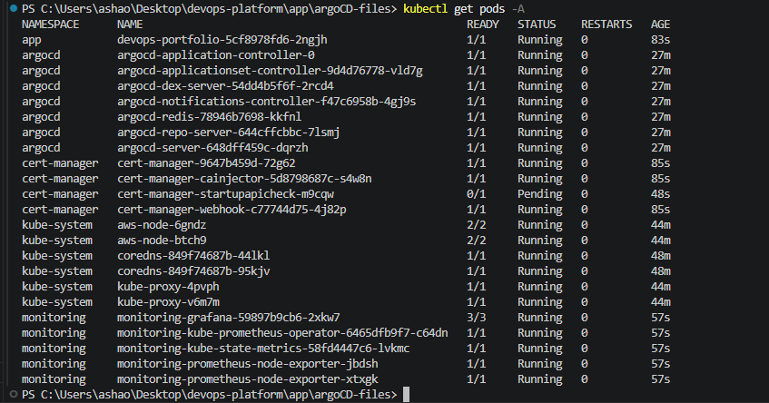

# Cloud-Native GitOps Platform on AWS EKS

A production-grade infrastructure-as-code project utilizing Terraform to provision an AWS Elatic Kubernetes Service (EKS) cluster and configure a complete ArgoCD GitOps workflow

## Project Overview and Key Features

This project demonstrates a complete cloud-native GitOps deployment platform on AWS using Terraform, Kubernetes, GitHub Actions, Helm, and Argo CD. The platform automates infrastructure provisioning, application deployment, monitoring, logging, ingress management, and TLS certificate provisioning. The entire deployment lifecycle follows GitOps principles, where Git serves as the single source of truth for both infrastructure and application delivery.

## 🚀 Automated GitOps CI/CD Pipeline
```text
This project implements a fully automated, zero-downtime GitOps continuous integration and deployment workflow utilizing Git as the single source of truth:
```

+ **Continuous Integration**: Pushing updates to application code or the **Dockerfile** triggers the CI pipeline.
+ **Automated Manifest Updates**: The pipeline builds the new image and automatically updates the image tag within the Helm **values.yaml** file.
+ **GitOps CD Deployment**: ArgoCD detects the repository update and automatically synchronizes the new state to the Amazon EKS cluster.
+ **Zero Downtime**: Upgrades are rolled out smoothly with zero manual intervention and zero application downtime.

# Key Features:

The entire AWS architecture, comprising the VPC, subnets, EKS cluster, node groups and ArgoCD is provisioned using Terraform, entirely eliminating manual AWS console configuration. This infrastructure as code strategy guarantees:

+ Pre-deployment impact visibility using **terraform plan**
+ Reviewed pull request for all changes
+ A complete git-based audit trail
+ Seamless multi-region replication and easy tear-down of resources

## Infrastructure and Application Architecture

```text
┌─────────────────────────────┐
│        Developer            │
└─────────────┬───────────────┘
              │ git push
              ▼
┌─────────────────────────────┐
│          GitHub             │
│ Source Code + Helm Charts   │
└─────────────┬───────────────┘
              │
              ▼
┌─────────────────────────────┐
│      GitHub Actions         │
│                             │
│ • Build Docker Image        │
│ • Run Validation            │
│ • Push Image to ECR         │
│ • Update values.yaml        │
└─────────────┬───────────────┘
              │
              ▼
┌─────────────────────────────┐
│         Amazon ECR          │
│ Docker Image Registry       │
└─────────────┬───────────────┘
              │
              ▼
┌─────────────────────────────┐
│          Argo CD            │
│ GitOps Continuous Delivery  │
└─────────────┬───────────────┘
              │ Sync
              ▼
═══════════════════════════════════
      AWS EKS CLUSTER
═══════════════════════════════════

┌─────────────────────────────┐
│     NGINX Ingress           │
└─────────────┬───────────────┘
              │
              ▼
┌─────────────────────────────┐
│       Application           │
│       Kubernetes            │
│       Deployment            │
└─────────────┬───────────────┘
              │
     ┌────────┴────────┐
     ▼                 ▼

┌───────────────┐ ┌───────────────┐
│ Cert Manager  │ │ Prometheus    │
│ TLS/HTTPS     │ │ Metrics       │
└───────┬───────┘ └───────┬───────┘
        │                 │
        ▼                 ▼
┌───────────────┐ ┌───────────────┐
│ Grafana       │ │ Loki          │
│ Dashboards    │ │ Logs          │
└───────────────┘ └───────────────┘
```
<p align="center">
  
</p>

```text
═══════════════════════════════════
 Terraform Provisioned:
 • VPC
 • Public & Private Subnets
 • Security Groups
 • EKS Cluster
 • Node Groups
═══════════════════════════════════
```
## 🔧 Tech Stack:
```text
• Terraform
• AWS EKS
• Docker
• Amazon ECR
• GitHub Actions
• Helm
• Argo CD
• NGINX Ingress Controller
• Cert Manager
• Prometheus
• Grafana
• Loki
```
## Project Workflow
### Infrastructure provisioning
### Terraform provisions
+ VPC
+ Public Subnets
+ Private Subnets
+ Route Tables
+ NAT Gateway
+ Security Groups
+ EKS Cluster
+ Managed Node Group
## Continious Integration (CI)
code pushed to GitHub
GitHub Actions automatically:
+ Builds Docker image
+ Run Validation
+ Tags image
+ Pushes image to Amazon ECR
+ Updates Helm values.yaml
+ Commits updated image tag
## Continuous Delivery (GitOps)
Argo CD continuously monitors the Git repository.

When Helm values.yaml changes:
+ Argo CD detects change
+ Syncs cluster
+ Pulls latest image
+ Deploys new application version
## Kubernetes Platform Services
The EKS cluster hosts:

### Application
+ Web application deployment
+ Service
+ Ingress
### Monitoring
+ Prometheus
+ Grafana
### Logging
+ Loki
### Security
+ Cert Manager
+ TLS Certificates
---
# Prerequisites

Install:

* AWS CLI
* kubectl
* Terraform
* Helm
* Docker

Configure AWS credentials:

```bash
aws configure
#input your aws access key ID, aws secret access key, default region and default output format
```

---

# Deployment Guide

## Step 1: Clone Repository

```
bash
# create a GitHub repo, clone it
git clone https://github.com/<username>/<repository>.git

cd <repository>
#in the argoCD-GitOps-files,update the root-app.yml, application-app.yml and the myapp.yml repoURL to
#your just created repo
git add .
git commit -m "updated GitOps manifest"
git push origin main
```

---

## Step 2: Deploy Infrastructure

```bash
cd terraform-eks-cluster-files
#update remote backend.tf(optional)
#if remote backend do not want to be configured
#delete the backend.tf file
#a terraform.tfstate file will be configured for you automatically on the first terraform init
#note that this is stored locally

#update the terraform.tfvars.example file accordingly, instructions in the file
#now you can run the commands below

#text
#argo cd has been bootstrapped with the eks terraform file
#the data "aws_eks_cluster" "eks" {
#  name = module.eks.cluster_name
#}

#data "aws_eks_cluster_auth" "eks" {
#  name = module.eks.cluster_name
#}providers #in the providers.tf
#needs to be commented out before runnung terraform apply so the infrastructure can be created first
#and uncommented so terraform apply is ran again to install argo CD on the cluster
```
```text
terraform init
```
```text
terraform plan
```

<p align="center">
  
</p>

```text
terraform apply
```
<p align="center">
  
</p>


---


## Step 3: Configure kubectl

```bash
aws eks update-kubeconfig \
--region us-east-1 \
--name devops-gitops-eks
```

Verify:

```bash
kubectl get nodes
```
<p align="center">
  
</p>

---

## Step 4: Install Argo CD

```bash
kubectl create namespace argocd
```

```bash
helm repo add argo https://argoproj.github.io/argo-helm
```

```bash
helm install argocd argo/argo-cd \
-n argocd
```

Verify:

```bash
kubectl get pods -n argocd
```
<p align="center">
  
</p>

---

## Step 5: Deploy Argo CD Infrastructure and Applications

```bash
kubectl apply -f argoCD-files/root-app.yaml
```
<p align="center">
  
</p>

Verify:

```bash
kubectl get infrastructure -n argocd
```
---

## Step 6: Access Argo CD

Retrieve password:

```bash
kubectl -n argocd get secret argocd-initial-admin-secret \
-o jsonpath="{.data.password}" | base64 -d
```

Port-forward:

```bash
kubectl port-forward svc/argocd-server \
-n argocd 8080:443
```
<p align="center">
  
</p>

Access:

```text
https://localhost:8080
```
<p align="center">
  
</p>

---

# Monitoring

Prometheus collects cluster metrics.

Grafana provides dashboards for:

* CPU
* Memory
* Node health
* Application metrics

---

# Logging

Loki provides:

* Centralized logs
* Application log aggregation
* Kubernetes log visibility

---

# CI/CD Pipeline

Trigger:

```text
Push to GitHub
```

Pipeline Actions:

```text
Build Docker Image
        ↓
Push Image to ECR
        ↓
Update Helm values.yaml
        ↓
Commit Changes
        ↓
Argo CD Sync
        ↓
Deploy to EKS
```
<p align="center">
  
</p>

---

# Validation

Verify cluster:

```bash
kubectl get nodes
```

Verify workloads:

```bash
kubectl get pods -A
```
<p align="center">
  
</p>

Verify services:

```bash
kubectl get svc -A
```

Verify ingress:

```bash
kubectl get ingress -A
```

Verify Argo CD:

```bash
kubectl get infrastructure -n argocd
```

---
## cleanup
#delete all resources deployed with argocd
```text
kubectl delete applications --all -n argocd
```
#delete namespaces
```text
kubectl delete namespace argocd
```
#destroy infrastructure
```text
terraform destroy -auto-approve
```
#Remove kubectl-config context
```text
kubectl config get-contexts
kubectl config delete-context <context-name>
